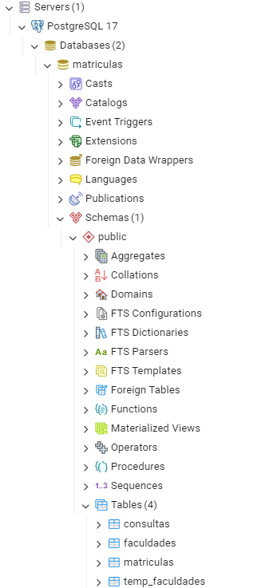

# Sistema matrículas

Nomes: Douglas B. e Rafael M.

**Linguagem:** Python<br/>
**Framework:**  Flask<br/>
**Arquitetura:**  MVC (Model View Controller)<br/>
**Persistência:**  Repository + DAO + PostgreSQL<br/>
**Interface:**  Web (HTML + CSS com Jinja2 no Flask)<br/>
**Fonte de dados:** Matriculados Brasil - Projeto.csv

Objetivo: Fazer análises agregadas por curso, ano, estado e modalidade, com armazenamento de consultas recentes.

Estrutura do Projeto:

matriculas_controller.py: Possui todas as rotas web, instancia os objetos de DAO e Repository e redireciona o usuário para as Views
matricula_dao.py: Armazena a engine para conectar no banco de dados e tem métodos para cada consulta
matricula_repository.py: Um Repository que tem o seu objeto DAO com os métodos que realizam as consultas
static: imagem do site e css usado nas tabelas
templates: View do projeto, contém todos os HTMLs usados na aplicação

O projeto conta com 3 consultas principais:
Matriculados por ano, podendo filtrar por modalidade e estado;
Ranking de cursos com mais matrículas, podendo filtrar por ano e estado;
Ranking de faculdades com mais matrículados, podendo filtrar por ano e estado.

Além de uma aba que permite visualizar todas as consultas feitas com os seus resultados.

---

## Execução do projeto:

1. Crie um ambiente e instale todos os requisitos do arquivo "*requirements.txt*".

2. Crie um arquivo .env no diretório raíz, com os seguintes conteúdos:

    ```
    USER = 'postgres'
    PORT = '5432'
    ENROLL_TABLE = 'matriculas'
    PW = 'ucs'
    HOST = 'localhost'
    ```

3. Com PostgreSQL instalado, crie um banco de dados "matriculas" e rode o arquivo "create.sql" da pasta "data" no pgAdmin.

    (Na linha 52, mude o caminho para encontrar o CSV.)<br/>
    (Se o postgresql não tiver permissão, pôr em um diretório no C:\ e rodar a partir de lá.)
    <br/><br/>
    Assim deve ficar:

    

4. Execute o arquivo run.py 
